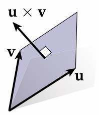
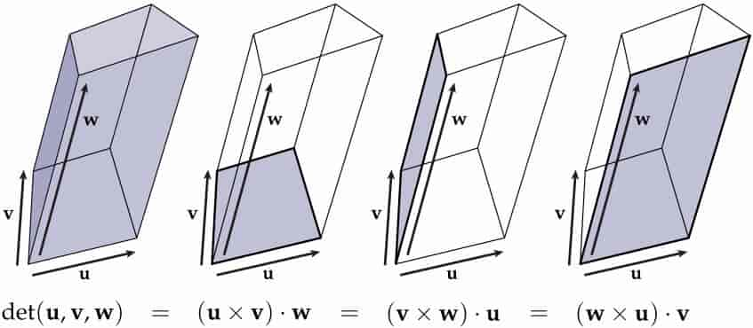
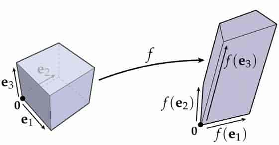
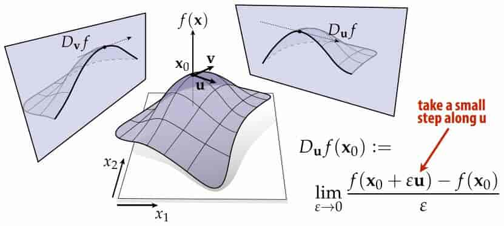
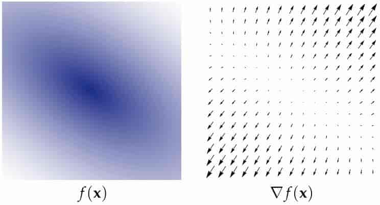
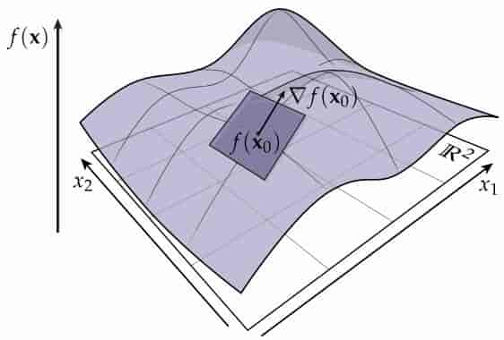
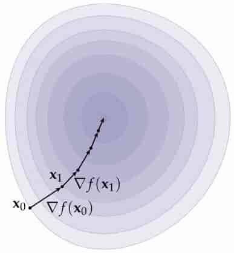
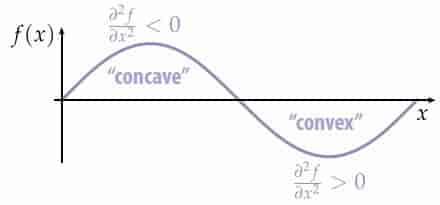
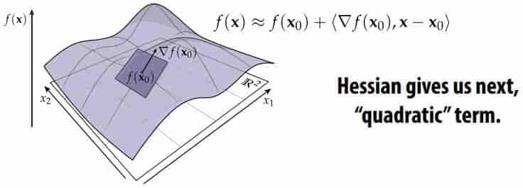

# 03 Math (P)Review Part II: Vector Calculus

### 3.1 Vector and Matrix

**Euclidean Norm**

Euclidean norm is any notion of length preserved by rotations/translations/refections of space.

In orthonormal coordinates : $|\mathbf{u}|:=\sqrt{u_1^2+...+u_n^2}$

**Euclidean Inner Product / Dot Product**

For n-dimensional vectors, Euclidean inner product defned as $\langle\mathbf{u},\mathbf{v}\rangle:=|\mathbf{u}||\mathbf{v}|\cos\theta$

In orthonormal Cartesian coordinates, it can be represented via the ==dot product==
$$
\mathbf{u}\cdot\mathbf{v}:=u_1v_1+...+u_nv_n
$$
**Cross Product**

- magnitude equal to parallelogram(平行四边形) area

- direction orthogonal to both vectors

- Simple but useful observation for manipulating vectors in 3D: cross product with a unit vector N is equivalent to a quarter-rotation in the plane with normal N

  

**Matrix Representation of Dot Product**
$$
\mathbf{u}\cdot\mathbf{v}=\mathbf{u}^\text{T}\mathbf{v}
=\begin{bmatrix} u_1\ ...\ u_n \end{bmatrix}
=\begin{bmatrix} v_1\\ .\\.\\.\\ v_n \end{bmatrix}
=\sum_{i=1}^nu_iv_i
$$
**Matrix Representation of Cross Product**
$$
\mathbf{u}:=(u_1,u_2,u_3)\\
\widehat{\mathbf{u}}:
=\begin{bmatrix} 0 & -u_3 & u_2\\ u_3 & 0 & -u_1\\ -u_2 & u_1 & 0\end{bmatrix}\\
\mathbf{u}\times \mathbf{v}=\widehat{\mathbf{u}}\mathbf{v}\\
\mathbf{v}\times \mathbf{u}=-\widehat{\mathbf{u}}\mathbf{v}=\widehat{\mathbf{u}}^\text{T}\mathbf{v}
$$
**Determinant**

det(u,v,w) encodes (signed) volume of parallelpiped with edge vectors u, v, w. 

> 叉乘项的两个向量在行列式中相邻且同顺序

**Representing Linear Maps via Matrices**

Key example: suppose I have a linear map $f(\mathbf{u})=u_1\mathbf{a}_1+u_2\mathbf{a_2}+u_3\mathbf{a}_3$, so
$$
A:=\begin{bmatrix} | & | & |\\ \mathbf{a_1} & \mathbf{a_2} & \mathbf{a_3}\\ | & | & |\end{bmatrix}\\
A\begin{bmatrix} u_1 \\ u_2\\ u_3\end{bmatrix}=u_1\mathbf{a}_1+u_2\mathbf{a}_2+u_3\mathbf{a}_3
$$
det(A) measures the change in volume.

**Other Triple Products**

- Jacobi identity: $\mathbf{u}\times(\mathbf{v}\times\mathbf{w})+\mathbf{v}\times(\mathbf{w}\times\mathbf{u})+\mathbf{w}\times(\mathbf{u}\times\mathbf{v})=0$
- Lagrange's identity: $\mathbf{u}\times(\mathbf{v}\times\mathbf{w}) = \mathbf{v}(\mathbf{u}\cdot\mathbf{w})-\mathbf{w}(\mathbf{u}\cdot\mathbf{v})$

### 3.2 Derivative

$$
f'(x_0):=\lim\limits_{\epsilon\to0}\frac{f(x_0+\epsilon)-f(x_0)}{\epsilon}
$$

differentiable at $x_0$ if $f^{'+}(x_0)^=f^{'-}(x_0)$

**Derivative as Best Linear Approximation**

Any smooth function f(x) can be expressed as a Taylor series: 
$$
f(x)=f(x_0)+f'(x_0)(x-x_0)+\frac{(x-x_0)^2}{2!}f''(x_0)+...
$$
Replacing complicated functions with a linear (and sometimes quadratic) approximation is a powerful trick in graphics algorithms.

**Directional Derivative**

**Gradient**

Given a multivariable function $f(\mathbf{x})$ , gradient $\nabla f(\mathbf{x})$ assigns a vector at each point:

 Most familiar defnition: list of partial derivatives
$$
\nabla f(\mathbf{x})=\begin{bmatrix} \partial f/\partial x_1\\...\\ \partial f/\partial x_n \end{bmatrix}
$$
Two potential problems:

- Role of inner product is not clear
- No way to differentiate functions of functions F(f) since we don’t have a fnite list of coordinates $x_1, …, x_n$ 

Still, extremely common way to calculate the gradient

Another way to think about it: at each point $x_0$, gradient is the vector $\nabla f(\mathbf{x_0})$ that leads to the best possible approximation
$$
f(\mathbf{x})=f(\mathbf{x_0})+\langle{\nabla f(\mathbf{x_0}),\mathbf{x}-\mathbf{x_0}}\rangle
$$

Another way to think about it: direction of “steepest ascent” 

**Gradient and Directional Derivative**

At each point x, gradient is unique vector $\nabla f(\mathbf x)$ such that $\langle{\nabla f(\mathbf{x}), \mathbf{u}}\rangle=D_\mathbf{u}f(\mathbf{x})$ for all u.

**Gradient of Matrix-Balued Expressions**
$$
\nabla_\mathbf{x}(\mathbf{x}^\text{T}\mathbf{y})=\mathbf{y}\\
\nabla_\mathbf{x}(\mathbf{x}^\text{T}\mathbf{x})=2\mathbf{x}\\
\nabla_\mathbf{x}(\mathbf{x}^\text{T}A\mathbf{y})=A\mathbf{y}\\
\nabla_\mathbf{x}(\mathbf{x}^\text{T}A\mathbf{x})=2A\mathbf{x}
$$

> Excellent resource: Petersen & Pedersen, “The Matrix Cookbook” 

**$L^2$ Gradient**

Consider a function of a function $F(f)$. What is the gradient of F with respect to f ? Can’t take partial derivatives anymore! Instead, look for function ∇F such that for all functions u,
$$
\langle\nabla F,u\rangle=D_u F
$$
and $D_u F$ is 
$$
D_u F(f)=\lim\limits_{\epsilon\to 0}\frac{F(f+\epsilon u)-F(f)}{\epsilon}
$$
Example

- $F(f):=\langle{f,g}\rangle,{\nabla F}=g$
- $F(f):={||f||}^2,{\nabla F(f_0)=2f_0}$

> Key idea: Once you get the hang of taking the gradient of ordinary functions, it’s (superfcially) not much harder for more exotic objects like matrices, functions of functions, … 

### 3.3 Vector Fields

Gradient was our frst example of a ==vector field== .

In general, a vector feld assigns a vector to each point in space .

**Divergence**

div X, also commonly written as $\nabla\cdot X$

Suggests a coordinate defnition for divergence

Think of $\nabla$ as a “vector of derivatives”: $\nabla=(\frac{\partial}{\partial u_1},...,\frac{\partial}{\partial u_n})$ 

Think of X as a “vector of functions” : $X(\mathbf{u})=(X_1(\mathbf{u}),...,X_n(\mathbf{u}))$

Then divergence is $\nabla\cdot X=\sum_{i=1}^n\partial X_i/\partial u_i$

> $\nabla \cdot X = \text{sum}(\nabla X)$

**Curl**

curl X, also commonly written as $\nabla \times X$

Suggests a coordinate defnition for curl

This time, think of $\nabla$ as a vector of just three derivatives: $\nabla =(\frac{\partial}{\partial u_1},\frac{\partial}{\partial u_2},\frac{\partial}{\partial u_3})$

Think of X as vector of three functions: $X(\mathbf{u})=(X_1(\mathbf{u}),X_2(\mathbf{u}),X_3(\mathbf{u}))$

Then curl is 
$$
\nabla \times X := 
\begin{bmatrix}
\partial X_3/\partial u_2 - \partial X_2/\partial u_3\\
\partial X_1/\partial u_3 - \partial X_3/\partial u_1\\
\partial X_2/\partial u_1 - \partial X_1/\partial u_2\\
\end{bmatrix}
$$
**Laplacian**

Visual Intuition

Likewise, Laplacian measures “curvature”(曲率) of a function

Maps a scalar function to another scalar function (linearly!) 

Usually* denoted by $\Delta$

> \* Or by $\nabla ^2$, but we'll reserve this symbol for the *Hessian*

Many starting points for Laplacian: 

- divergence of gradient $\Delta f=\nabla \cdot \nabla f=\text{div}(\text{grad}\ f)$
- sum of 2nd partial derivatives $\Delta f:=\sum_{i=1}^n\partial^2 f/\partial x_i^2$
- gradient of Dirichlet energy : $\Delta f := -\nabla_f(\frac{1}{2}||\nabla f||^2)$
- by analogy: graph Laplacian 
- ...

**Hessian**

Hessian will help us locally approximate complicated functions by a few simple terms.

Typically denote Hessian by symbol $\nabla ^2$

Just as gradient was “vector that gives us partial derivatives of the function,” Hessian is “operator that gives us partial derivatives of the gradient”: 
$$
(\nabla^2 f)\mathbf{u}:=D_\mathbf{u}(\nabla f)
$$
For a function f(x): Rn→R, can be more explicit: 
$$
\nabla^2 f=
\begin{bmatrix}
\frac{\partial^2f}{\partial x_1 \partial x_1} &  ... & \frac{\partial^2f}{\partial x_1 \partial x_n}\\
... & ... & ...\\
\frac{\partial^2f}{\partial x_n \partial x_1} &  ... & \frac{\partial^2f}{\partial x_n \partial x_n}\\
\end{bmatrix}
$$
Using Hessian, can now write 2nd-order approximation of any smooth, multivariable function f(x) around some point $x_0$:

 

