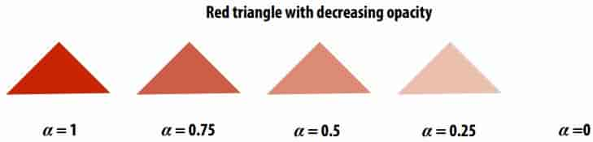
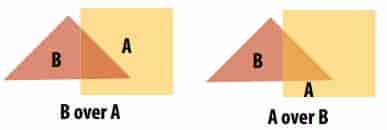
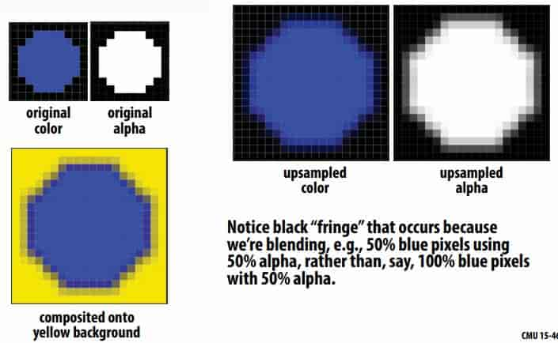
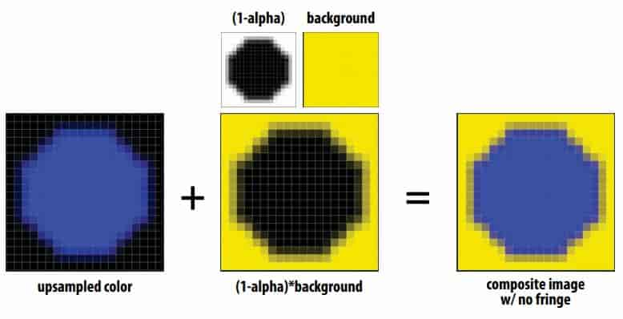
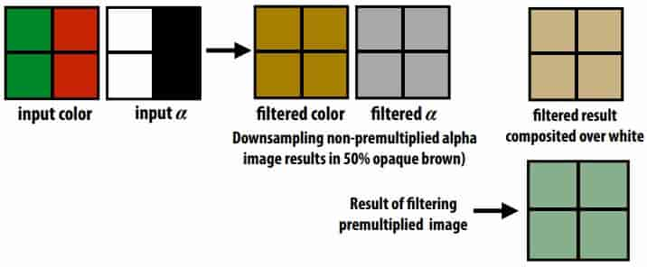

# 08 Depth & Transparency 

## 8.1 Occlusion

**Sampling Depth**

Assume we have a triangle given by:
– the projected 2D coordinates (xi,yi) of each vertex
– the “depth” of each vertex (i.e., distance from the viewer) 

> Q: How do we compute the depth d at a given sample point (x,y)?
> A: ==Interpolate it using barycentric coordinates== (just like any other attribute that varies linearly over the triangle) 

**The depth-buffer(Z-buffer)**

For each coverage sample point, depth-buffer stores the depth of the closest triangle seen so far. 

work with interpenetrating surfaces and supersampling

## 8.2 Compositing

**Representing opacity as alpha**

Alpha describes the opacity of an object 

Alpha: additional channel of image (RGBA) 

**Over operator**

Composite image B with opacity $\alpha_B$ ==over== image A with opacity $\alpha_A$ 

$$
A over B != B over A
$$
"Over" is not commutative

> The simplest example: opaque objects are completely different before and after transparent objects

**non-premultiplied alpha**
$$
\begin{aligned}
A&=(R_A,G_A,B_A)\\
B&=(R_B,G_B,B_B)\\
C&=\alpha_B B+(1-\alpha_B)\alpha_A A\\
\end{aligned}
$$
**premultiplied alpha**
$$
\begin{aligned}
A'&=\alpha_A A\\
B'&=\alpha_B B\\
C'&=B'+(1-\alpha_B)A'\\
\alpha_C&=\alpha_B+(1-\alpha_B)\alpha_A
\end{aligned}
$$
Notice premultiplied alpha composites alpha just like how it composites rgb. 

Non-premultiplied alpha composites alpha differently than rgb. 

**Problems with non premultiplied alpha**

- Fringe

if we instead use the premultiplied "over" operation, we get the correct alpha

- Pre-filtering

> **Non-premultiplied**
>
> filtered (color,alpha)= (0.5, 0.5, 0, 0.5)，rst color over white = (0.75, 0.75, 0.5)，多了红色
>
> The red background color that should have no impact (because $\alpha=0$) is mixed with green during filtering
>
> **Premultiplied**
>
> filtered (color,alpha)= (0, 0.5, 0, 0.5)，rst color over white = (0.5, 0.75, 0.5)，normal

- Applying “over” repeatedly 

Non-premultiplied alpha is not closed under composition 
$$
\begin{aligned}
A&=(R_A,G_A,B_A)\\
B&=(R_B,G_B,B_B)\\
C&=\alpha_B B+(1-\alpha_B)\alpha_A A\\
\alpha_C&=\alpha_B+(1-\alpha_B)\alpha_A
\end{aligned}
$$
Consider that A and B are red with a transparency of 0.5, then C=[0.75,0,0], $\alpha_C=0.75$ , C becomes premultiplied alpha, which means Non-premultiplied alpha is not closed

> The correct calculation of C is as follows
>
> $A'=(0.5,0,0)$
>
> $B'=(0.5,0,0)$
>
> $C'=(0.75,0,0),\ \alpha_C=(0.75,0,0)$
>
> $C=C'/\alpha_C=(1.0,0,0)$

**Summary: advantages of premultiplied alpha**

- Simple: compositing operation treats all channels (RGB and A) the same 

- More efficient than non-premultiplied representation: “over” requires fewer math ops 

- Closed under composition 

- Better representation for fltering (upsampling/downsampling) textures with alpha channel 

