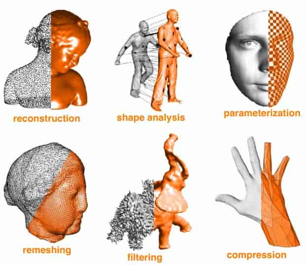
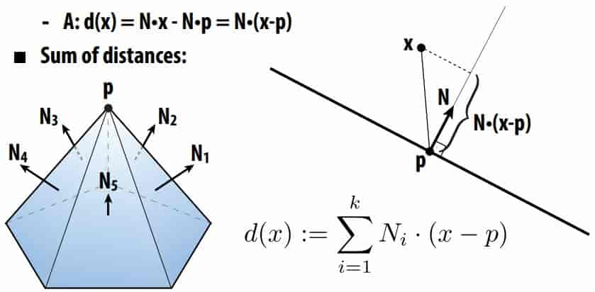
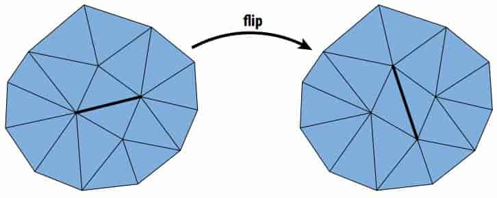
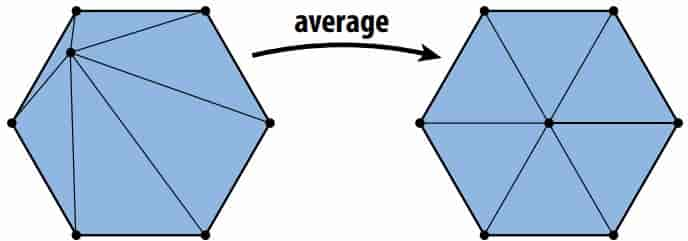

# 11 Digital Geometry Processing 

**Geometry Processing Tasks**

- Reconstruction : Given samples of geometry, reconstruct surface 
- Upsampling : Increase resolution via interpolation 
- Downsampling : Decrease resolution; try to preserve shape/appearance 
- Resampling : Modify sample distribution to improve quality 
- Filtering : Remove noise, or emphasize important features 
- Compression : Reduce storage size by eliminating redundant data/approximating unimportant data 
- Shape Analysis : Identify/understand important semantic features 

## 11.1 Upsample

**Upsampling via Subdivision**

- Repeatedly split each element into smaller pieces 

- Replace vertex positions with weighted average of neighbors 

**Catmull-Clark Subdivision**

- Step 0: split every polygon (any # of sides) into quadrilaterals: 
- New vertex positions are weighted combination of old ones: 

>  [Wikipedia](https://en.wikipedia.org/wiki/Catmull-Clark_subdivision_surface) 
>
> R 是对 edge 的 原中心 进行计算

> 适用于四边形网格，在三角网格上效果不好
>
> 
>
> 

**Loop Suibdivision**

- Subdivision scheme for triangle meshes 

- Curvature is continuous away from irregular vertices (“C2”) 

- Algorithm:

  - Split each triangle into four (4-1 subdivision)

  - Assign new vertex positions according to weights

    

    > 先进行原顶点的更新（右图），在进行新顶点的更新（左图）

- 4-1 subdivision

  1. Split every edge of the mesh *in any order whatsoever*.
  2. Flip any new edge that touches a new vertex and an old vertex.

  

## 11.2 Simplification

**Edge Collapse**

- Greedy algorithm:
  - assign each edge a cost
  - collapse edge with least cost
  - repeat until target number of elements is reached 

- Particularly effective cost function: ==quadric error metric==

  

**Distance**

Distance is sum of point-to-plane distances 

**Quadric Error Matrix**

Suppose in coordinates we have 

- a query point $(x,y,z)$ 

- a normal $(a,b,c)$ 

- an offset $d := -(p,q,r) \cdot(a,b,c)$ , point (p, q, r) is on the plane

then in homogeneous coordinates let $\mathbf{u}=(x,y,z,1),\ \mathbf{v} =(a,b,c,d)$

Signed distance to plane is then just $\mathbf{u}\cdot\mathbf{v}=ax+by+cz+d$

Squared distance is 
$$
      (\mathbf{u}^\text{T}\mathbf{v})^2=\mathbf{u}^\text{T}(\mathbf{v}\mathbf{v}^\text{T})\mathbf{u}=\mathbf{u}^\text{T}K\mathbf{u}
$$

the K is

> Key idea: matrix K encodes distance to plane 

**Quadric Error of Edge Collapse** 

How much does it cost to collapse an edge? 

Idea: compute ==edge midpoint==, measure ==quadric error==

> 这里的 quadric error 是 new point 到 edge 两端点所有的邻接三角形的所在平面的二次距离和，即
> $$
> Q_{P_{new}}=Q_{p_1}+Q_{p_2}=\sum_{s\in S(p_1)\cup S(p_2)}K_s\\
> \text{error}=P_{new}^\text{T}Q_{P_{new}}P_{new}
> $$
>

Better idea: use ==point that minimizes quadric error== as new point! 

**Minimizing a Quadratic Form**
$$
f(\mathbf{x})=\mathbf{x}^\text{T}A\mathbf{x}+\mathbf{u}^\text{T}\mathbf{x}+\mathbf{v}\\
f'(\mathbf{x})=2A\mathbf{x}+\mathbf{u}=0\\
\mathbf{x}=-\frac{1}{2}A^{-1}\mathbf{u}
$$

> not always have a minimum, maybe a maximum

**Positive Defnite Quadratic Form**

When matrix A is positive-definite:
$$
\mathbf{x}^{\text T}A\mathbf{x}>0,\forall\mathbf{x}
$$
we get a minimun

**Minimizing Quadratic Error**

Find “best” point for edge collapse by minimizing quad. form 
$$
\min_u{\mathbf{u}^{\text T}K\mathbf{u}}
$$
Already know fourth (homogeneous) coordinate is 1! 

So, break up our quadratic function into two pieces: 

Can minimize as before: 
$$
\begin{aligned}
2B\mathbf{x}+2\mathbf{w}&=0\\
B\mathbf{x}&=-\mathbf{w}\\
\mathbf{x}&=-B^{-1}\mathbf{w}
\end{aligned}
$$
**Quadric Error Simplifcation: Final Algorithm**

- Compute K for each triangle (distance to plane) 
- Set K at each vertex to sum of $K_s$ from incident triangles 
- Set K at each edge to sum of $K_s$ at endpoints 
- Find point at each edge minimizing quadric error 
- Until we reach target # of triangles: 
  - collapse edge (i,j) with smallest cost to get new vertex m 
  - add $K_i$ and $K_j$ to get quadric $K_m$ at m 
  - update cost of edges touching m 

## 11.3 Resample

**Delaunay**

Already have a good tool: edge fips! 

If α+β > π, fip it! 

FACT: in 2D, fipping edges eventually yields Delaunay mesh

Theory: worst case O(n2); no longer true for surfaces in 3D.

Practice: simple, effective way to improve mesh quality 

**Degree**

Same tool: edge fips! 

If total deviation from degree-6 gets smaller, fip it! 

FACT: average valence of any triangle mesh is 6

Iterative edge fipping acts like “discrete diffusion” of degree

Again, no (known) guarantees; works well in practice 

**Triangle Round**

Delaunay doesn’t mean triangles are “round” (angles near 60°) 

Can often improve shape by centering vertices: 

Simple version of technique called “Laplacian smoothing”. 

On surface: move only in tangent direction 

How? Remove normal component from update vector

**Isotropic Remeshing Algorithm**

Try to make triangles uniform shape & size 

Repeat four steps: 

- Split any edge over 4/3rds mean edge legth

- Collapse any edge less than 4/5ths mean edge length
- Flip edges to improve vertex degree
- Center vertices tangentially 