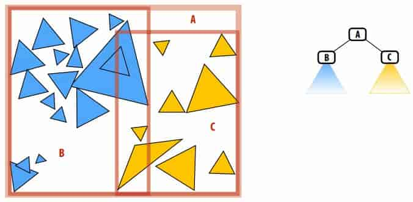
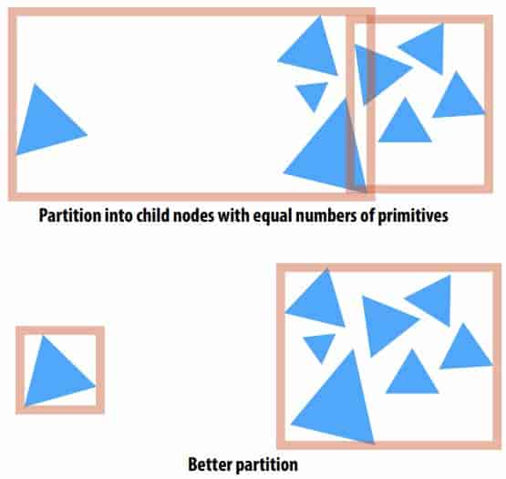
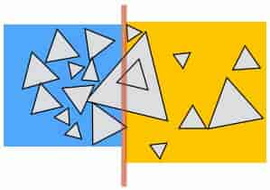
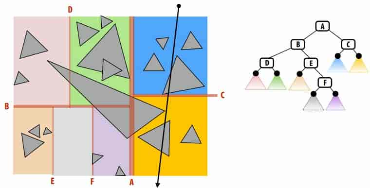
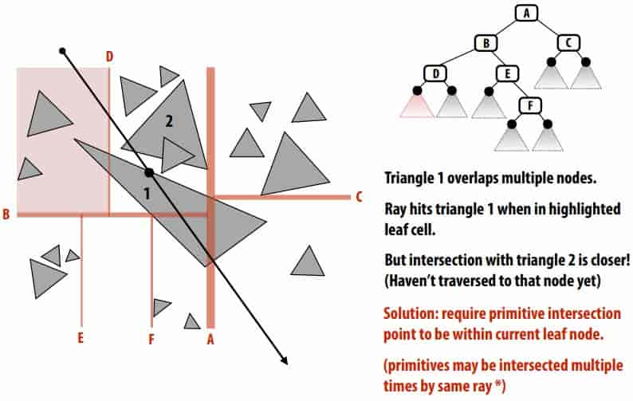
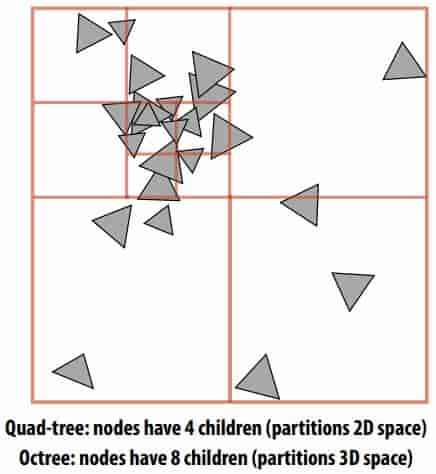

# 13 Spatial Data Structures 

## 13.1 Bounding volume hierarchy (BVH)

**structure**

- Leaf nodes: Contain small list of primitives 

- Interior nodes

  - Proxy(代理) for a large subset of primitives 
  - Stores bounding box for all primitives in subtree 

- BVH partitions each node’s primitives into disjoints sets (不相交的集合)

  > Note: The sets can still be overlapping in space 
  >
  > 

**simple code**

```c++
struct BVHNode {
    bool leaf; // am I a leaf node?
    BBox bbox; // min/max coords of enclosed primitives
    BVHNode* child1; // “left” child (could be NULL)
    BVHNode* child2; // “right” child (could be NULL)
    Primitive* primList; // for leaves, stores primitives
};

struct HitInfo {
    Primitive* prim; // which primitive did the ray hit?
    float t; // at what t value?
};

void find_closest_hit(Ray* ray, BVHNode* node, HitInfo* closest) {
    // test ray against node’s bounding box
    HitInfo hit = intersect(ray, node->bbox);
    if (hit.prim == NULL || hit.t > closest.t))
    	return; // don’t update the hit record
    
    if (node->leaf) {
        for (each primitive p in node->primList) {
        	hit = intersect(ray, p);
            if (hit.prim != NULL && hit.t < closest.t) {
                closest.prim = p;
                closest.t = t;
            }
    	}
    } else {
    	find_closest_hit(ray, node->child1, closest);
    	find_closest_hit(ray, node->child2, closest);
	}
}
```

**Improvement: “front-to-back” traversal** 

```c++
void find_closest_hit(Ray* ray, BVHNode* node, HitInfo* closest) {
if (node->leaf) {
    for (each primitive p in node->primList) {
        (hit, t) = intersect(ray, p);
        if (hit && t < closest.t) {
            closest.prim = p;
            closest.t = t;
    	}
	}
} else {
    HitInfo hit1 = intersect(ray, node->child1->bbox);
    HitInfo hit2 = intersect(ray, node->child2->bbox);
    NVHNode* first = (hit1.t <= hit2.t) ? child1 : child2;
    NVHNode* second = (hit2.t <= hit1.t) ? child2 : child1;
    find_closest_hit(ray, first, closest);
    if (second child’s t is closer than closest.t)
    	find_closest_hit(ray, second, closest);
}
```

## 13.2 build a high-quality BVH

**Intuition**

want small bounding boxes (minimize overlap between children, avoid empty space) 

not just partition into child nodes with equal numbers of primitives 



**Cost of making a partition**

A good partitioning minimizes the cost of finding the closest intersection of a ray with primitives in the node. 

- If a node is a leaf node (no partitioning): 
  $$
  C=\sum_{i=1}^NC_\text{isect}(i)=NC_\text{isect}
  $$
  > Where  $C_\text{isect}(i)$ is the cost of ray-primitive intersection for primitive i in the node 
  >
  > (Common to assume all primitives have the same cost) 

- Cost of making a partition 

  The expected cost of ray-node intersection, given that the node’s primitives are partitioned into child sets A and B is: 
  $$
  C=C_\text{trav}+p_AC_A+p_BC_B
  $$
  > $C_\text{trav}$ is the cost of traversing an interior node (e.g., load data, bbox check) 
  > $C_A$ and $C_B$ are the costs of intersection with the resultant child subtrees
  > $p_A$ and $p_B$ are the probability a ray intersects the bbox of the child nodes A and B

  Primitive count is common approximation for child node costs: 
  $$
  C=C_\text{trav}+p_AN_AC_A+p_BN_BC_B
  $$

- Estimating probabilities

  For ==convex== object A inside convex object B, the probability that a random ray that hits B also hits A is given by the ratio of the ==surface areas== $S_A$ and $S_B$ of these objects. 

  $$
  P(\text{hit}\ A|\text{hit}\ B)=\frac{S_A}{S_B}
  $$

  Leads to surface area heuristic (SAH): 
  $$
  \begin{aligned}
  C
  &=C_\text{trav}+\frac{S_A}{S_N}N_AC_\text{isect}+\frac{S_B}{S_N}N_BC_\text{isect}\\
  &=C_\text{trav}+\frac{C_\text{isect}}{S_N}(S_AN_A+S_BN_B)
  \end{aligned}
  $$

  > Assumptions of the SAH (which may not hold in practice!):
  > - Rays are randomly distributed
  > - Rays are not occluded 

  so we need to find a partition to minimize $S_AN_A+S_BN_B$

**Implementing partitions**

- axis-aligned spatial partitions

  Constrain search for good partitions to axis-aligned spatial partitions

  - Choose an axis; choose a split plane on that axis

  - Partition primitives by the side of splitting plane their centroid lies

  - SAH changes only when split plane moves past triangle boundary

    > ?? 我觉得应该是经过三角形中心时变化，因为 S 应该是包围盒面积
    >
    > 包围盒面积由其内三角形确定，三角形是否在内部由其中心决定

  - Have to consider rather large number of possible split planes… 

- Efficiently implementing partitioning 

  Efficient modern approximation: split spatial extent of primitives into B buckets

  (B is typically small: B < 32) 

  

  ```c++
  for(axis : {x,y,z}){
      initialize buckets
      for(primitive & p : node){
          b = compute_bucket(p.centroid);
          b.bbox.union(p.bbox);
          b.prim_count++;
      }
      for(plane : partitioning planes)
          evaluate SAH;
  }
  Recurse on lowest cost partition found or make node a leaf
  ```

- Troublesome cases 

  

  In general, different strategies may work better for different types of geometry / different distributions of primitives… 

### 13.3 Space-Partitioning Structures 

**Primitive-partitioning acceleration structures vs. space-partitioning structures**

Primitive partitioning (bounding volume hierarchy): partitions node’s primitives into disjoint sets (but sets may overlap in space) 


Space-partitioning (grid, K-D tree) partitions space into disjoint regions (primitives may be contained in multiple regions of space) 



**K-D tree**

- Recursively partition space via axis-aligned partitioning planes 
  - Interior nodes correspond to spatial splits
  - Node traversal can proceed in front-to-back order
  - Unlike BVH, can terminate search after frst hit is found. 

  

- Challenge: objects overlap multiple nodes 

  Want node traversal to proceed in front-to-back order so traversal can terminate search after first hit found
  
  

**Uniform Grid**

- Partition space into equal sized volumes 

- Each grid cell contains primitives that overlap voxel. (very cheap to construct acceleration structure) 

- Walk ray through volume in order 

  - Very efficient implementation possible (think: 3D line rasterization) 
  - Only consider intersection with primitives in voxels the ray intersects 

- Grid resolution 

  Heuristic: Choose number of voxels ~ total number of primitives 

  (constant prims per voxel — assuming uniform distribution of primitives) 

  Intersection cost: $O(n^{\frac{1}{3}})$

  > grow faster than $\log(N)$ 

- Uniform grid cannot adapt to non-uniform distribution of geometry in scene 

**Quad-tree/octree**

Like uniform grid: easy to build (don’t have to choose partition planes) 

Has greater ability to adapt to location of scene geometry than uniform grid. 

But lower intersection performance than K-D tree (only limited ability to adapt) 



**Summary of spatial acceleration structures**

Choose the right structure for the job! 

- Primitive vs. spatial partitioning:
    - Primitive partitioning: partition sets of objects

      > Bounded number of BVH nodes, simpler to update if primitives in scene change position
    - Spatial partitioning: partition space

      > Traverse space in order (first intersection is closest intersection), may intersect primitive multiple times
- Adaptive structures (BVH, K-D tree)
    - More costly to construct (must be able to amortize(摊销) cost over many geometric queries)
    - Better intersection performance under non-uniform distribution of primitives
- Non-adaptive accelerations structures (uniform grids)
    - Simple, cheap to construct
    - Good intersection performance if scene primitives are uniformly distributed
- Many, many combinations thereof… 