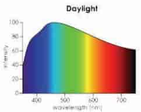
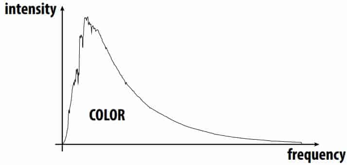
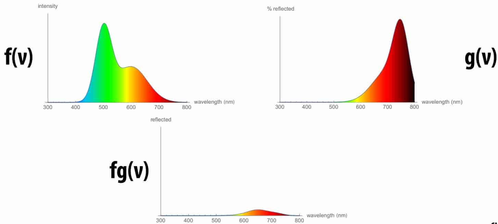
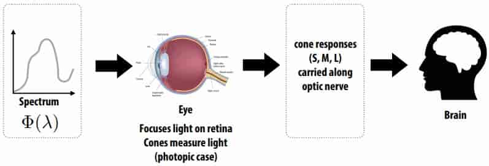
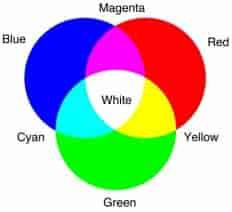
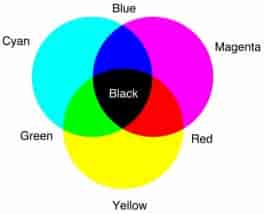
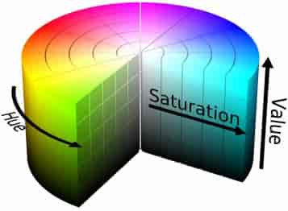
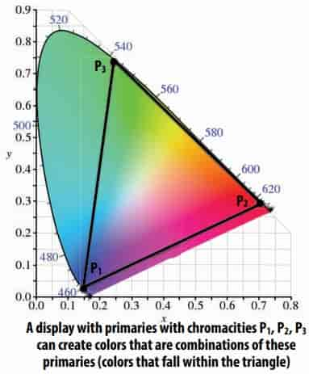
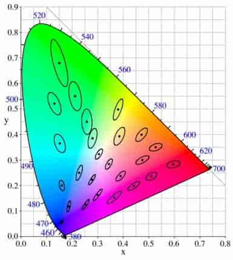

# 14 Color

Light is EM Radiation; Color is Frequency 

**Most light is not visible!**

- Frequencies visible by human eyes are called “visible spectrum 
- These frequencies what we normally think of as “color” 

“White” light is really a mixture of all (visible) frequencies 

**Additive vs. Subtractive Models of Light**

- emission  spectrum

  - How much light is produced, useful for, e.g., characterizing color of a light bulb 

  - Describes light intensity as a function of frequency 

    

- absorbtion spectrum

  - How much light is absorbed, useful for, e.g., characterizing color of paint, ink, etc. 
  - Emission spectrum is intensity as a function of frequency 

- This is the fundamental description of color: intensity or absorption as a function of frequency 

  

  Everything else is merely a convenient approximation! 

**Interaction of emission and refection**

Light source has emission spectrum $f(\nu)$

Surface has refection spectrum $g(\nu)$

Resulting intensity is the product  $f(\nu)g(\nu)$

> $\nu$—frequency (Greek “nu”) 

**Photosensor response**

- Photosensor input: light 

  Electromagnetic power distribution over wavelengths: $\Phi(\lambda)$

- Photosensor output: a “response” … a number 

- Spectral response function: $f(\lambda)$

  Sensitivity of sensor to light of a given wavelength 

- Total response of photosensor 
  $$
  R=\int_\lambda{\Phi}(\lambda)f(\lambda)d\lambda
  $$

**The eye’s photoreceptor cells: rods & cones**

- Rods are primary receptors under dark viewing conditions (scotopic conditions) 

- Cones are primary receptors under high-light viewing conditions (photopic conditions, e.g., daylight) 

  > Each of the three types of cone feature a different spectral response. 

**Spectral response of cones**

Three types of cones: S, M, and L cones (corresponding to peak response at short, medium, and long wavelengths) 

> Uneven distribution of cone types in eye 
>
> ~ 64% of cones are L cones, ~ 32% M cones 

$$
S=\int_\lambda\Phi(\lambda)S(\lambda)d\lambda\\
M=\int_\lambda\Phi(\lambda)M(\lambda)d\lambda\\
L=\int_\lambda\Phi(\lambda)L(\lambda)d\lambda\\
$$

Figure visualizes cone’s response to smonochromatic light (light with energy in a single wavelength) as points in 3D space 

**The human visual system**

Human eye does not directly measure the spectrum of incoming light 

The eye measures three response values = (S, M, L). The result of integrating the incoming spectrum against response functions of S, M, L-cones 

**Metamers**

Metamers = two different spectra that integrate to the same (S,M,L) response! 

**Color Spaces and Color Models**

In general, specify a color from some color space using a color model 

Color space is like artist’s palette: full range of colors we can choose from

Color model is the way a particular color in a color space is specifed 

**Additive vs. Subtractive Color Models**

> A better name than subtractive might be multiplicative, since we multiply to get the fnal color! 

- Additive : Used for, e.g., combining colored lights 

  

- Subtractive : Used for, e.g., combining paint colors 

  

**Other Common Color Models**

- HSV

  - hue, saturation, value
    

  - more intuitive than RGB/CMYK 

- SML—physiological model

  - corresponds to stimulus of cones 
  - not practical for most color work 

- XYZ—preceptually driven model 

  - Y captures luminance (intensity) 
  - X,Z capture chromaticity (color) 
  - related to, but different from, SML 

- Lab—“perceptually uniform” modifcation of XYZ 

**CIE 1931* Color Space**

> *CIE 1931 does not mean anything important: “created in 1931 by the Commission Internationale de l’Éclairage" 

- Standard “reference” color space 

- Encompasses all colors visible by “most” human observers 

  > associated color model (XYZ) captures perceptual effects 
  >
  > e.g., perception of color (“chromaticity”) changes with brightness (“luminosity”) 

**Chromaticity Diagrams**

Chromaticity is the intensity-independent component of a color 

Chromaticity diagram used to visualize extent of a color space 

**sRGB Color Space**

- CIE 1934 captured all possible human-visible colors 

- sRGB (roughly) subset of colors available on displays, printers, … 

- Nonlinear relationship between stored RGB values & intensity 

  > Makes better use of limited set of numerical values 

**Color Acuity**

In addition to range of colors visible, one might be interested in how sensitive people are to changes in color 

Each ellipse corresponds to a region of “just noticeable differences” of color (chromaticity) 

So, if you want to make two colors distinct, might try to avoid overlapping ellipses… 

**Color Conversion**

Given a color specifed in one model/space (e.g., sRGB), try to find corresponding color in another model (e.g., CMYK) 

In a perfect world: want to match output spectrum 

Even matching perception of color would be terrifc (metamers) 

In reality: may not always be possible!

> Depends on the gamut of the output device 

Complicated task! Lots of standards & software 

**Gamma correction**

1. Image contains value X 
2. CRT display converts digital signal to an electron beam voltage V(x) (linear relationship) 
3. Electron beam voltage converted to light: $L=cV^\gamma, \gamma\approx2.5$ (non-linear relationship) 

> (Doesn’t apply to modern LCD displays, whose luminance output is linearly proportional to input; DOES still apply to other devices, like sensors, etc.) 

