## 15 Radiometry

- System of units and measures for measuring EM radiation (light) 
- Geometric optics model of light 
  - Photons travel in straight lines
  - Represented by rays
  - Wavelength << size of objects
  - No diffraction, interference, … 

## 15.1 Concept

> Names don’t constitute knowledge! 

**What do we want to measure (and why?)**

Many physical processes convert energy into photons 

Each photon carries a small amount of energy 

Want some way of recording “how much energy” 

Energy of photons hitting an object ~ “brightness 

> Need this information to make accurate (and beautiful!) images 

Simplifying assumption: “steady state” process 

**Radiant energy is “total # of hits”** 

Imagine every photon is a little rubber ball hitting the scene: 


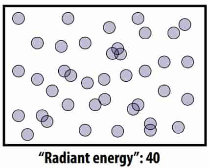

**Radiant flux is “hits per second”** 

For illumination phenomena at the level of human perception, usually safe to assume equilibrium is reached immediately.

So, rather than record total energy over some (arbitrary) duration, may make more sense to record total hits per second 

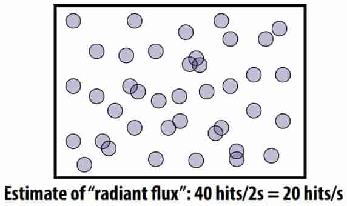

**Irradiance is “#hits per second, per unit area”** 

Typically we want to get more specifc than just the total 

To make images, also need to know where hits occurred 

So, compute hits per second in some “really small” area


**Image generation as irradiance estimation**

From this point of view, our goal in image generation is to estimate the irradiance at each point of an image (or really: the total radiant fux per pixel…): 


## 15.2 Measuring illumination 

**Radiant Energy**

Energy of a single photon 

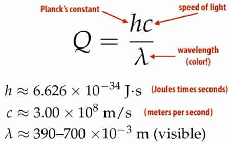

> unit is $(J\times s)(m/s)/m=J$
>
> Aside: Units are a powerful debugging tool 

**radiant fux**

Flux: energy per unit time (Watts) received by the sensor (or emitted by the light) 
$$
\Phi=\lim\limits_{\Delta\to0}\frac{\Delta Q}{\Delta t}=\frac{dQ}{dt}(J/s)
$$

> J/s is Watts

Can also go the other direction: time integral of flux is total radiant energy
$$
Q=\int_{t_0}^{t_1}\Phi(t)dt
$$
**irradiance**

Irradiance: area density of fux 

Given a sensor of with area A, we can consider the average fux over the entire sensor area
$$
\frac{\Phi}{A}
$$
Irradiance (E) is given by taking the limit of area at a single point on the sensor: 
$$
E(p)=\lim\limits_{\Delta \to 0}\frac{\Delta\Phi(p)}{\Delta A}=\frac{d\Phi(p)}{dA}(W/m^2)
$$
**Spectral power distribution**

Energy per unit time per unit area per unit wavelength 

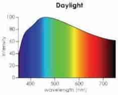

**Lambert’s Law** 

Irradiance at surface is proportional to cosine of angle between light direction and surface normal 

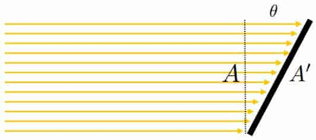
$$
E'=\frac{\Phi}{A'}=\frac{\Phi \cos\theta}{A}=E\cos\theta
$$
**“N-dot-L” lighting**

Most basic way to shade a surface: take dot product of unit surface normal (N) and unit direction to light (L) 

```c++
double surfaceColor(Vec3 N, Vec3 L){
    return max(0., dot(N, L));
}
```

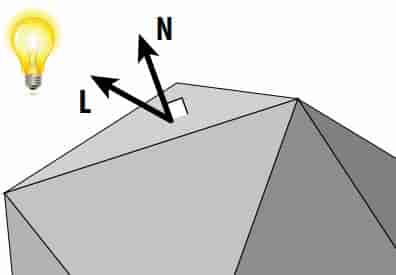

**Isotropic point source**


$$
\Phi=\int_{S(r)}E(r)\ dA\\
E(r)=\frac{\Phi}{4\pi r^2}
$$
**Irradiance falloff with distance**

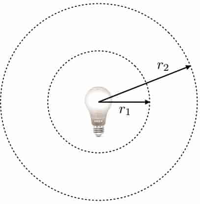
$$
\frac{E(r_2)}{E(r_1)}=(\frac{r_1}{r_2})^2
$$
**Angles and solid angles**

- Angle : ratio of subtended arc length on circle to radius 

  - $\theta=\frac{l}{r}$
  - circle has $2\pi$ ==radians==

  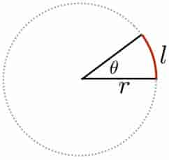

- Solid angle : ratio of subtended area on sphere to radius squared 

  - $\Omega=\frac{A}{r^2}$

  - sphere has $4\pi$ ==steradians==

    > unit is sr

  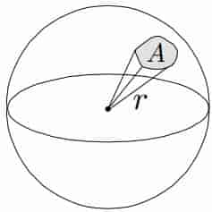

**Differential solid angle**

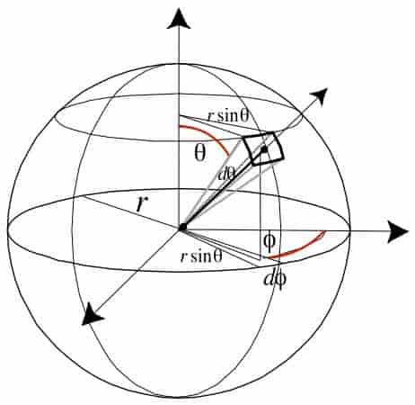
$$
\begin{aligned}
\text{d}\omega&=\frac{dA}{r^2}\\
dA&=(r\ \text{d}\theta)(r\sin\theta\ \text{d}\phi)\\
  &=r^2\sin\theta\ \text{d}\theta \text{d}\Phi\\
\text{d}\omega&=\sin \theta\ \text{d}\theta \text{d}\Phi\\
\end{aligned}
$$
Differential solid angle is just that tiny area on the unit sphere 

Will use $\omega $to donate a direction vector (unit length)


**Radiance**

Radiance is the solid angle density of irradiance
$$
L(\mathbf{p},\omega)=\lim\limits_{\Delta\to0}\frac{\Delta E_\omega(\mathbf{p})}{\Delta\omega}=\frac{\text{d}E_\omega(\mathbf{p})}{\text{d}\omega}(W/m^2sr)
$$
where $E_\omega$ denotes that the differential surface area is oriented to face in the direction $\omega$


In other words, radiance is energy along a ray defned by origin point p and direction $\omega$

> Energy per unit time per unit area per unit solid angle…! 

**Surface Radiance**
$$
L(\mathbf{p},\omega)=\frac{\text{d} E(\mathbf{p})}{\cos\theta\ \text{d}\omega}=\frac{\text{d}^2\Phi(\mathbf{p})}{\cos\theta\ \text{d}A\text{d}\omega}
$$
$\cos\theta$ accounts for different surface orientation


**Spectral Radiance**

To summarize, radiance is: radiant energy per unit time per unit area per unit solid angle 

To really get a complete description of light we have to break this down just one more step: radiant energy per unit time per unit area per unit solid angle per unit wavelength 

once we have spectral radiance, we have a complete description of the light in an environment! 

**Incident vs. Exitant Radiance**

Often need to distinguish between incident radiance and exitant radiance functions at a point on a surface 

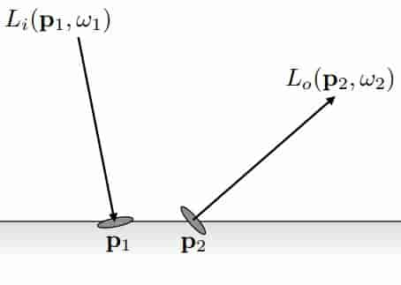

In general: $L_i(\mathbf{p},\omega)\ne L_o(\mathbf{p},\omega)$

**Properties of radiance**

- adiance is a fundamental feld quantity that characterizes the distribution of light in an environment
  - Radiance is the quantity associated with a ray
  - Rendering is all about computing radiance 

- Radiance is constant along a ray (in a vacuum(真空)) 

- A pinhole camera measures radiance 

**Irradiance from the environment**

Computing flux per unit area on surface, due to incoming light from all directions. 
$$
E(\mathbf{p},\omega)=\int_{H^2}L_i(\mathbf{p},\omega)\cos\theta\ \text{d}\omega
$$
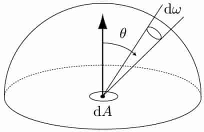

**Simple case: irradiance from uniform hemispherical source**
$$
\begin{aligned}
E(\mathbf{p})
&=\int_{H^2}L\cos\theta\ \text{d}\omega\\
&=L\int_0^{2\pi}\int_0^{\frac{\pi}{2}}\cos\theta\sin\theta\ \text{d}\theta\text{d}\phi\\
&=L\pi
\end{aligned}
$$
**Irradiance from a uniform area source**
$$
\begin{aligned}
E(\mathbf{p})
&=\int_{H^2}L(\mathbf{p},\omega)\cos\theta\ \text{d}\omega\\
&=L\int_\Omega\cos\theta\ \text{d}\omega\\
&=L\Omega^\perp
\end{aligned}
$$

> $\Omega^\perp$ is Projected solid angle
>
> - Cosine-weighted solid angle 
>
> - Area of object O projected onto unit sphere, then projected onto plane 
>
>   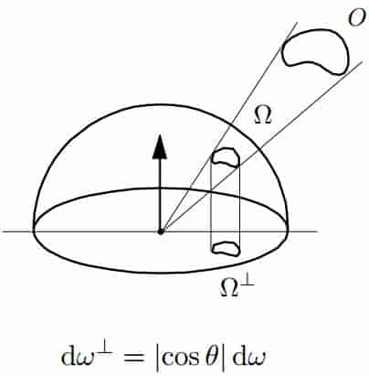

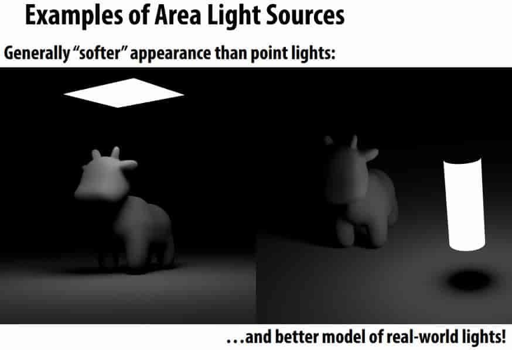

**Ambient occlusion**

- Assume spherical (vs. hemispherical) light source, “at infnity”
- Irradiance is now rotation, translation invariant
- Can pre-compute, “bake” into texture to enhance shading 


**radiant intensity**

Power per solid angle emanating from a point source 

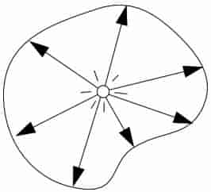
$$
I(\omega)=\frac{\text{d}\Phi}{\text{d}\omega}(W/sr)
$$

## 15.3 Appendix


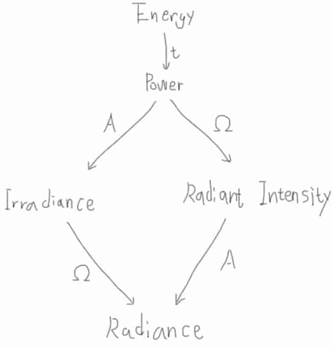