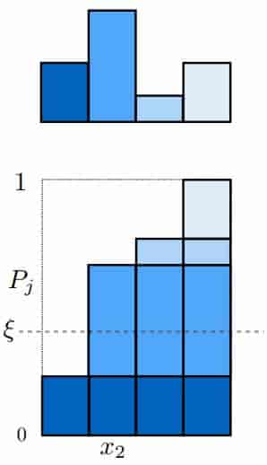
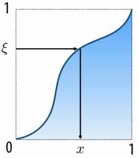
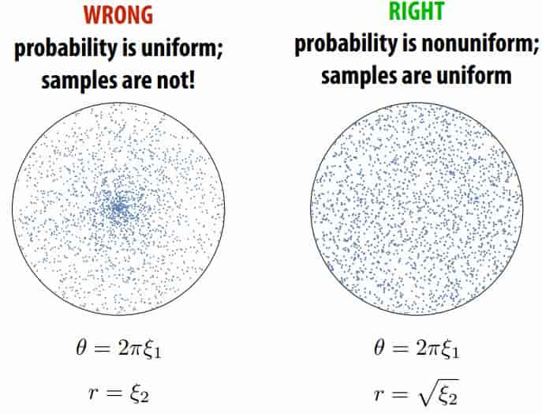
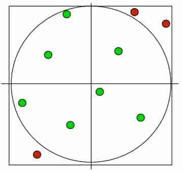
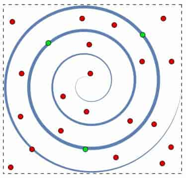

# 17 Numerical Integration 

**Overview**

In graphics, many quantities we’re interested in are naturally expressed as integrals (total brightness, total area, …) 

For very, very simple integrals, we can compute the solution analytically 

For everything else, we have to compute a numerical approximation 

Basic idea:
- integral is “area under curve” or average value times size of domain 
- sample the function at many points
- integral is approximated as weighted sum

**Monte Carlo Integration**

Estimate value of integral using random sampling of function 

Only requires function to be evaluated at random points on its domain 

==Error of estimate is independent of the dimensionality of the integrand, depends on the number of random samples used== 

> **MCI from Wikipedia** 
>
> > https://en.wikipedia.org/wiki/Monte_Carlo_integration
>
> The Monte Carlo integration problem is to calculate multi-dimensional definite integrals
> $$
> I=\int_\Omega f(\overline{x})\ \text{d}\overline{x}
> $$
> in $\Omega$ is a subset of $R^m$ and has volume
> $$
> V=\int_\Omega \text{d}\overline{x}
> $$
> The simplest Monte Carlo method is to sample uniformly in Ω to get N uniform samples
> $$ 
> \overline{x}_1, \overline{x}_2,...,\overline{x}_N\in\Omega 
> $$
> $I$ estimated to be
> $$
> I\approx Q_N=V\frac{1}{N}\sum_{i=1}^Nf(\overline{x}_i)=V\langle f\rangle
> $$
> The law of large numbers ensures
> $$
> \lim\limits_{N\to\infty}Q_N=I
> $$
> Considering $Q_N$, the error bar of $Q_N$ can be estimated through the sample variance using unbiased estimator
> $$
> Var(f)=\sigma^2_N=\frac{1}{N-1}\sum_{i=1}^N(f(\overline x_i)-\langle f\rangle)^2
> $$
> Therefore
> $$
> Var(Q_N)=\frac{V^2}{N^2}Var(\sum_{i=1}^Nf(\overline x_i))=\mathbf{V^2}\frac{\sigma^2_N}{N}
> $$
> As long as $\{\sigma^2_1,\sigma^2_2,...\}$ is bounded, the variance decreases at the rate of $\frac{1}{N}$, independent of the dimension of the integral
>
> It is important to note that unlike deterministic methods, the estimate of error is not a strict error bound; random sampling may not discover all important features of the integrand, and these features may lead to an underestimation of the error.
>
> In addition, non-uniformly distributed samples can be used, generally used for importance sampling
>
> > https://en.wikipedia.org/wiki/Importance_sampling
>
> The new distribution is optimal
>$$
> \frac{f(x)}{I}
>$$
> At this time, one sample can achieve a variance of 0, because this distribution itself contains the integral $I$ we want to find, so there will be no error
>
> But actually what we require is I, so we cannot directly obtain the optimal distribution

**Importance Sampling** 

> Here is a good blog post: https://www.cnblogs.com/time-flow1024/p/10094293.html

Consider Random Variables
$$
Y=\frac{f(X)}{p(X)}
$$
Its probability density is $p(X)$ ，but
$$
E[Y]=\int_{\Omega}\frac{f(x)}{p(x)}p(x)dx=I
$$
Therefore, the mean value of Y can be used to estimate the integral value of f(x)
$$
I\approx Q_N=\frac{1}{N}\sum_{i=1}^N Y_i=\frac{1}{N}\sum_{i=1}^N \frac{f(x_i)}{p(x_i)}
$$
The variance is
$$
\sigma^2[Q_N]=\frac{1}{N}\sigma^2[Y]=\frac{1}{N}\sigma^2[\frac{f(X)}{p(X)}]
$$
> We consider uniform sampling to verify
>
> At this time $p(X)=\frac{1}{V}$, then the variance is $\sigma^2[F_N]=\frac{V^2}{N}\sigma^2[f(X)] $ , the same conclusion as before

Then, in order to minimize the variance, $p^*(x) = f(x)/I$.

This conclusion is meaningless, because we are here to find the integral value, and $p^*(x)$ contains the integral value

But this also gives us inspiration. We need to try to find p(x) that is close to f(x) for importance sampling.

**generate samples of a discrete random variable (with a known PDF)** 

To randomly select an event, select $x_i$ if $P_{i-1}<\xi\le P_i$

$P$ is the cumulative probability function $P_j=\sum_{i=1}^j p_i$

$\xi$ is a uniformly distributed random variable $\in [0,1)$

**Sampling continuous random variables using the inversion method**

Cumulative probability distribution function 
$$
P(x) = Pr(X < x)=\int_{-\infty}^xp(t)\ \text{d}t
$$
Construction of samples: solve for $x=P^{-1}(\xi)$ 

Must know the formula for:
1. The integral of $p(x)$ 
2. The inverse function $P^{-1}(x)$ 

**Uniformly sampling unit circle**

what is uniformly sampling?

it is $p(x_1,x_2,...,x_n)d_{x_1}d_{x_2}...d_{x_n}=dS(x_1,x_2,...,x_n)/Area$

so
$$
p(r,\theta)drd\theta=rdrd\theta/\pi\\
p(r,\theta)=r/\pi\\
p(r)p(\theta)=r/\pi\\
p(\theta)=c,p(r)=r/(c\pi)\\
P(\theta)=c\theta,P(2\pi)=2\pi c=1,c=\frac{1}{2\pi},\theta=2\pi\xi_1\\
p(r)=2r,P(r)=r^2,r=\sqrt{\xi_2}\\
$$

**Uniform sampling via rejection sampling**

Completely different idea: pick uniform samples in square (easy)
Then toss out any samples not in square (easy) 

If the region we care about covers only a very small fraction of the region we’re sampling, rejection is probably a bad idea: 

