# 19 Variance Reduction 

## 19.1 Sampling Strategies 

**Naïve Path Tracing**

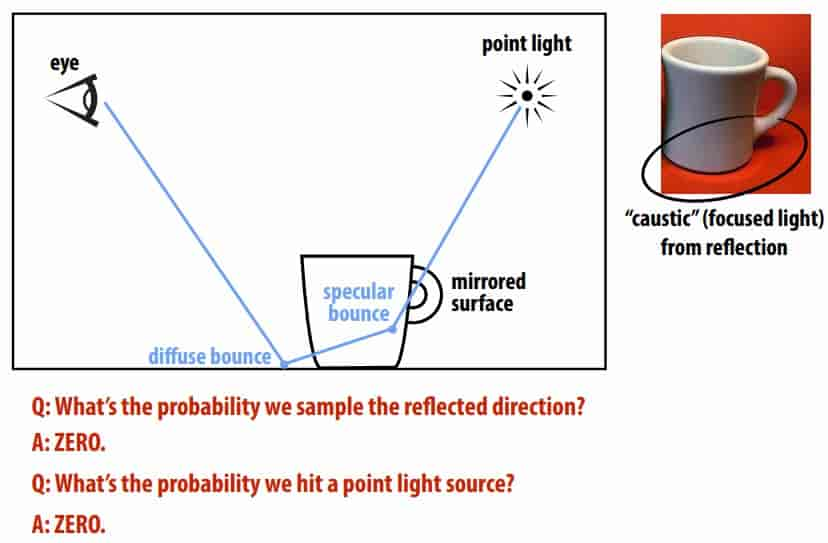

Naïve path tracing misses important phenomena! 

**Importance Sampling in Rendering** 

The following is the integral formula we require
$$
L_o(\mathbf{p},\omega_o)=L_e(\mathbf{p},\omega_o) + \int_{\mathcal{H}^2}f_r(\mathbf{p},\omega_i\to\omega_o)L_i(\mathbf{p},\omega_i)\cos\theta \ \text{d}\omega_i
$$
Considering importance sampling, then $p(x)$ should be close to $f_r(\mathbf{p},\omega_i\to\omega_o)L_i(\mathbf{p},\omega_i)\cos\theta$, but we do not If you don’t know the specific expression of this function, you can only find it through heuristic forms.

Consider the product terms separately

- $f_r(\mathbf{p},\omega_i\to\omega_o)$: We can determine the sampling rule based on BRDF. If we encounter a mirror, we will sample in the direction of mirror reflection.
- $L_i(\mathbf{p},\omega_i)$: We can determine the sampling rule according to the light source, such as sampling in the direction of the light source

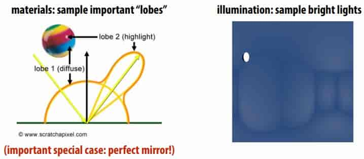

**Bidirectional Path Tracing** 

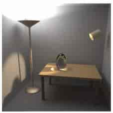

As mentioned before, sampling can be done based on the direction of the light source, which is direct lighting. But it requires no obstruction between it and the light source.
Considering the scene above, there is an obstruction between most positions in the scene and the light source, so simply sampling in the direction of the light source will not help.
Therefore consider bidirectional path tracing.
Forward path tracing: no control over path length (hits light after n bounces, or gets terminated by Russian Roulette) 
Idea: connect paths from light, eye (“bidirectional”) 
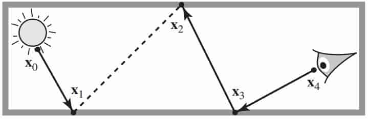

**Metropolis-Hastings Algorithm**

The two-way path tracing algorithm was mentioned before, but the problem is how to choose the path from the light source. Sometimes, most of the light's path is invalid.

Good paths can be hard to find

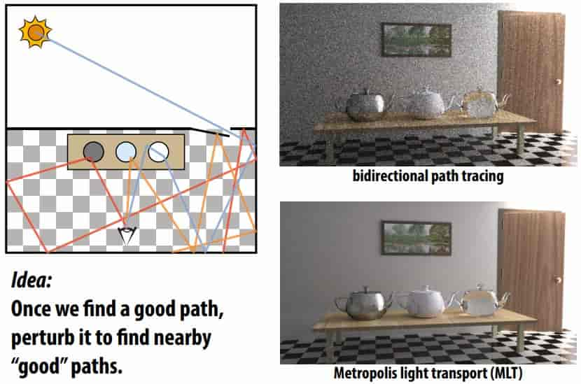

> perturb 

 Standard Monte Carlo: sum up independent samples 

MH: take random walk of dependent samples (“mutations”) 

Basic idea: prefer to take steps that increase sample value 

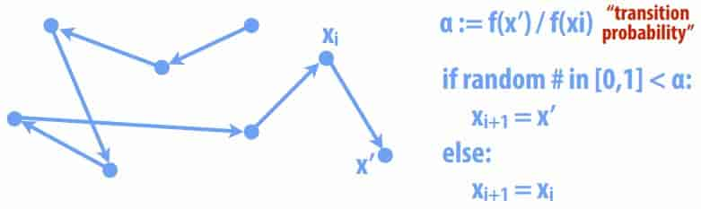

If careful, sample distribution will be proportional to integrand 

- make sure mutations are “ergodic”  
- need to take a long walk, so initial point doesn’t matter (“mixing”) 

> For more details about Metropolis-Hastings Algorithm, please refer to [wikipedia_MHA](https://en.wikipedia.org/wiki/Metropolis%E2%80%93Hastings_algorithm) 

**Metropolis-Hastings: Sampling an Image**

- Want to take samples proportional to image density f
- Start at random point; take steps in (normal) random direction
- Occasionally jump to random point (ergodicity)
- Transition probability is “relative darkness” f(x’)/f(xi) 

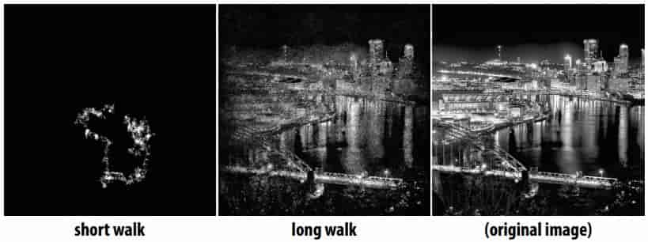

**Metropolis Light Transport** 

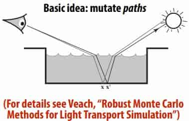

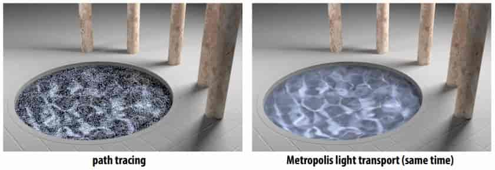

**Multiple Importance Sampling (MIS)** 

Many possible importance sampling strategies 

Which one should we use for a given integrand? 

MIS: combine strategies to preserve strengths of all of them 

Balance heuristic is (provably!) about as good as anything

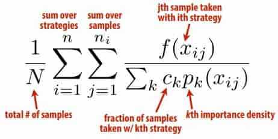

> $Nc_k$ That is the number of samples of strategy k

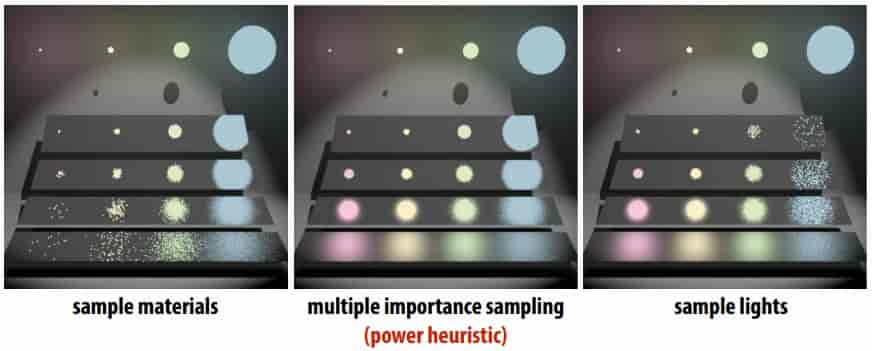

> The picture on the left is sampled based on BSDF
>
> The image on the right is sampled based on direct light
>
> The middle picture is a combination of the two
>
> Pay special attention to the calculation of the denominator. **The denominator needs to be calculated once for each sample** 

## 19.2 Sampling Patterns

**Sampling Patterns & Variance Reduction**

Want to pick samples according to a given density

But even for uniform density, lots of possible sampling patterns

Sampling pattern will affect variance (of estimator!) 

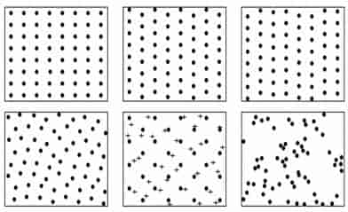

**Stratifed Sampling**

stratifed estimate never has larger variance (often lower) 

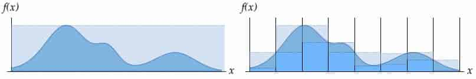

**Low-Discrepancy(差异) Sampling**

“No clumps(块)” hints at one possible criterion for a good sample 

Number of samples should be proportional to area

Discrepancy measures deviation from this ideal 

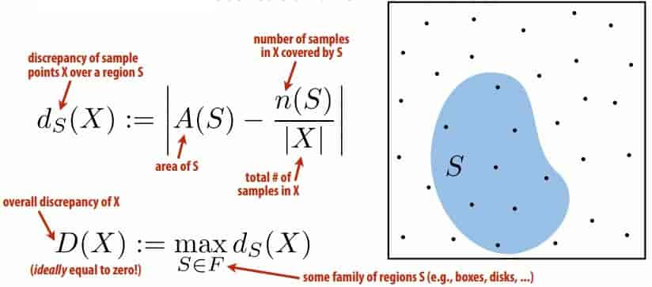

**Quasi-Monte Carlo methods (QMC)**

Replace truly random samples with low-discrepancy samples 

Why? Koksma’s theorem: 

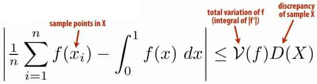

**Hammersley & Halton Points**

Can easy generate samples with near-optimal discrepancy 

First defne radical inverse  $\varphi_r(i)$ 

Express integer i in base r, then refect digits around decimal 

> φ10(1234) = 0.4321 

Can get n Halton points $x_1, …, x_n$ in k-dimensions via 
$$
x_i=(\phi_{P_1}(i),\phi_{P_2}(i),...,\phi_{P_k}(i))
$$
Similarly, Hammersley sequence is 
$$
x_i=(i/n,\phi_{P_1}(i),\phi_{P_2}(i),...,\phi_{P_{k-1}}(i))
$$

> n must be known ahead of time! 

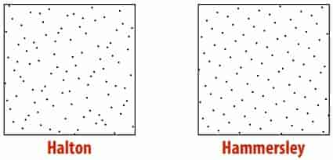

**Adaptive Blue Noise**

Can adjust cell size to sample a given density (e.g., importance) 

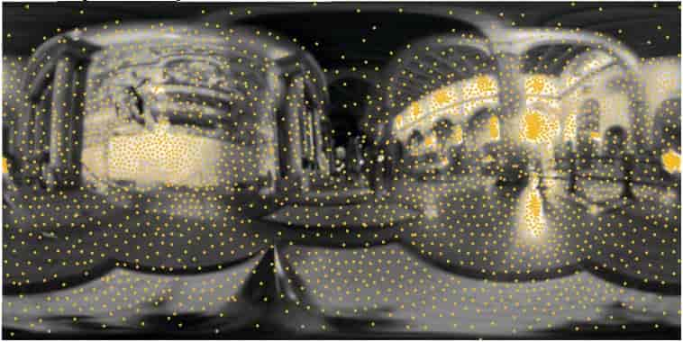

## 19.3 efficiently sample from a large distribution 

**Sampling from the CDF** 

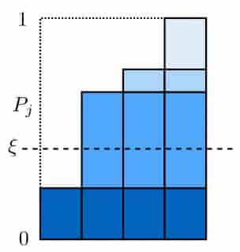

cost is $O(n\log n)$

> Don't understand
>
> Using the binary search method only costs $O(\log n)$
>
> It only takes $O(n)$ to create a table

**Alias Table** 

Get amortized **O(1)** sampling by building “alias table” 

Basic idea: rob from the rich, give to the poor (**O(n)**): 

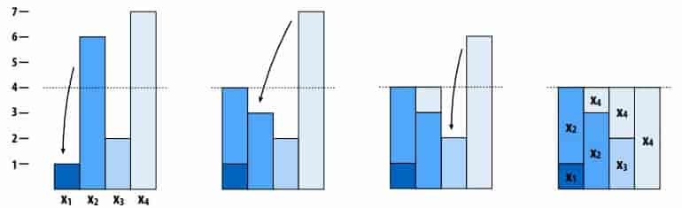

Table just stores **two identities** & **ratio of heights** per column 

> Build method
>
> 1. For n events, there are n columns, which are divided into two categories: empty and overflow.
> 2. For each overflow, find an empty one, and move as much as it is empty from the overflow place. After that, the overflow place may overflow, and it may be empty or just full.
> 3. Repeat step 2
To sample: 

- pick uniform # between 1 and n
- biased coin flip to pick one of the two identities in nth column 

## 19.4 Other techniques

- Photon Mapping 
- Finite Element Radiosity 
- ...

