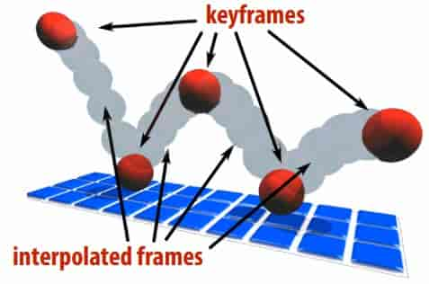
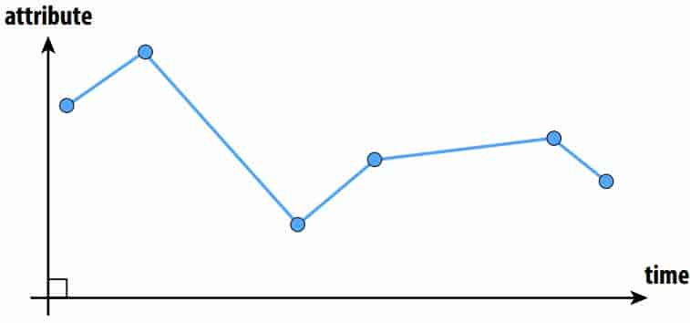
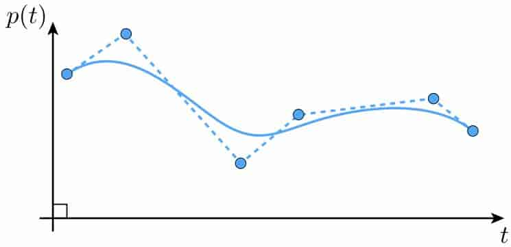
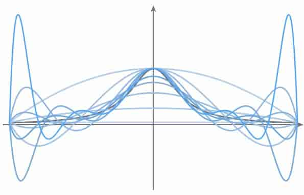
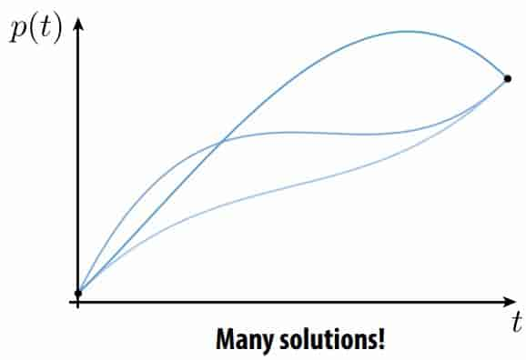
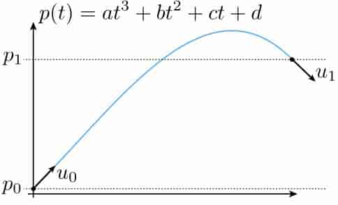
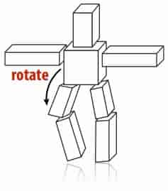
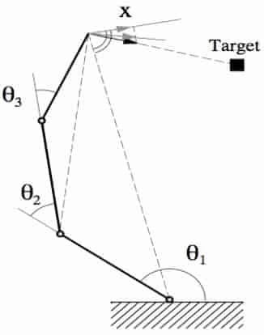
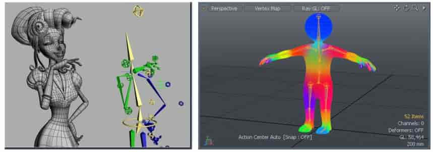

# 20 Introduction to Animation 

**Generating Motion (Hand-Drawn)** 

Senior artist draws keyframes 

Assistant draws inbetweens 

Tedious(乏味的) / labor intensive(集中的) (opportunity for technology!) 

**Keyframing**

Basic idea:
- specify important events only

  > “Events” don’t have to be position 
  >
  > Could be color, light intensity, camera zoom, ... 

- computer flls in the rest via interpolation/approximation 

# 19.1 Interpolation 

Basic idea: “connect the dots” 

**piecewise linear interpolation**

Simple, but yields rather rough motion (infnite acceleration) 

**Piecewise Polynomial Interpolation**

Common interpolant: piecewise polynomial “spline” 

Basic motivation: get better continuity than piecewise linear! 

**Splines**

In general, a spline is any piecewise polynomial function 

In 1D, spline interpolates data over the real line

“Interpolates” just means that the function exactly passes through those values: 
$$
f(x_i)=y_i,i=0,...,n
$$
The only other condition is that the function is a polynomial when restricted to any interval between knots 

**cubic polynomials**

Splines most commonly used for interpolation are cubic (d=3) 

piecewise cubics give exact solution to elastic spline problem under assumption of small displacements 

among all curves interpolating set of data points, minimizes norm of second derivative (not curvature) 

**Runge Phenomenon**

Tempting to use higher-degree polynomials, in order to get higher-order continuity 

Can lead to oscillation, ultimately worse approximation: 

**Cubic Polynomial - Degrees of Freedom** 

Cubic polynomial has four degrees of freedom (DOFs), namely four coefficients (a,b,c,d) that we can manipulate/control 

Only need two degrees of freedom to specify endpoints: 

Overall, four unknowns but only two equations

Not enough to uniquely determine the curve! 

Fitting Cubic to Endpoints and Derivatives 

This time, we have four equations in four unknowns 

> $p(t)=at^3+bt^2+ct+d$ 
>
> $p(t)=h_{00}(t)p_0+h_{10}(t)m_0+h_{01}(t)p_1+h_{11}(t)m_1$ 
>
> where $p_0$, $p_1$ are the endpoint positions,  $m_0$, $m_1$ are the endpoint tangents, and $h_{i,j}$ are the Hermite bases
> $$
> \begin{aligned}
> h_{00}(t)&=2t^3-3t^2+1\\
> h_{10}(t)&=t^3-2t^2+t\\
> h_{01}(t)&=-2t^3+3t^2\\
> h_{11}(t)&=t^3-t^2\\
> \end{aligned}
> $$
>

Often, this is the game we will play:
- each condition on spline leads to a linear equality
- hence, if we have m degrees of freedom, we need m (linearly independent!) conditions to determine spline 

**Natural Splines**

Now consider piecewise spline made of cubic polynomials $p_i$ 

For each interval, want polynomial “piece” $p_i$ to interpolate data (e.g., keyframes) at both endpoints: 
$$
p_i(t_i)=f_i,p_i(t_{i+1})=f_{i+1},i=0,...,n-1
$$
Want tangents to agree at endpoints (“$C^1$ continuity”): 
$$
p'_i(t_{i+1})=p'_{i+1}(t_{i+1}),i=0,...,n-2
$$
Also want curvature(曲率) to agree at endpoints (“$C^2$ continuity”): 
$$
p''_i(t_{i+1})=p''_{i+1}(t_{i+1}),i=0,...,n-2
$$
noe we have 4n-2 equations

Pin down remaining DOFs by ==setting curvature to zero at endpoints== (this is what makes the curve “natural”) 

**Spline Desiderata(拉丁语，迫切需要之物)** 

In general, what are some properties of a “good” spline?
- INTERPOLATION: spline passes exactly through data points
- CONTINUITY: at least twice differentiable everywhere
- LOCALITY: moving one control point doesn’t affect whole curve 

natural spline 

- INTERPOLATION: yes, by construction
- CONTINUITY: C2 everywhere
- LOCALITY: no, coefficients depend on global linear system 

**Hermite/Bézier Splines**

Each cubic “piece” specifed by endpoints and tangents

Equivalently: by four points (Bézier form); just take difference! 

More precisely, want endpoints to interpolate data: 
$$
p_i(t_i)=f_i,p_i(t_{i+1})=f_{i+1},i=0,...,n-1
$$
Also want tangents to interpolate some given data: 
$$
p'_i(t_i)=u_i,p'_i(t_{i+1})=u_{i+1},i=0,...,n-1
$$

> How is this different from our natural spline’s tangent condition?
> There, tangents didn’t have to match any prescribed value— they merely had to be the same. Here, they are given. 

4n conditions overall

Properties : INTERPOLATION and LOCALITY, but not C2 CONTINUITY 

**Catmull-Rom Splines** 

Sometimes makes sense to specify tangents (e.g., illustration)

Often more convenient to just specify values

Catmull-Rom: specialization of Hermite spline, determined by values alone 

Basic idea: use difference of neighbors to defne tangent 
$$
u_i=\frac{f_{i+1}-f_{i-1}}{t_{i+1}-t_{i-1}}
$$

All the same properties as any other Hermite spline (locality, etc.) 

Commonly used to interpolate motion in computer animation. 

Many, many variants, but Catmull-Rom is usually good starting point 

**B-Splines** 

Get better continuity and local control by sacrificing interpolation 

B-spline basis defned recursively: 

B-spline itself is then a linear combination of bases: 
$$
f(t)=\sum_ia_iB_{i,k}(t)
$$
**Character Animation**

Scene graph/kinematic chain: scene as tree of transformations 

Animate by interpolating transformations 

Often have sophisticated “rig”: 

**Inverse Kinematics** 

Important technique in animation & robotics 

Rather than adjust individual transformations, set “goal” and use algorithm to come up with plausible motion

**Jacobian Transpose** 

Minimize cost function
$$
\begin{align}
F&=\frac{1}{2}(\mathbf{x}_\text{target}-\mathbf{x})^T(\mathbf{x}_\text{target}-\mathbf{x})\\
&=\frac{1}{2}(\mathbf{x}_\text{target}-f(\theta))^T(\mathbf{x}_\text{target}-f(\theta))\\
&=\frac{1}{2}(\mathbf{x}_\text{target}-\mathbf{x_0}+\mathbf{x_0}-f(\theta))^T(\mathbf{x}_\text{target}-\mathbf{x_0}+\mathbf{x_0}-f(\theta))\\
&=\frac{1}{2}(\Delta\mathbf{x}-(f(\theta)-\mathbf{x}_0))^T(\Delta\mathbf{x}-(f(\theta)-\mathbf{x}_0))\\
&\approx\frac{1}{2}(\Delta\mathbf{x}-J(\theta)\Delta\theta)^T(\Delta\mathbf{x}-J(\theta)\Delta\theta)\\
\end{align}
$$
so we minimize cost function
$$
\arg\min_\limits{\Delta \theta}C(\Delta\theta)\\
\begin{align}
C(\Delta\theta)&=||J(\theta)\Delta\theta-\Delta\mathbf{x}||^2\\
\frac{\text{d}C}{\text{d}\Delta\theta}&=2J(\theta)^TJ(\theta)\Delta\theta-2J(\theta)^T\Delta\mathbf{x}\\
\frac{\text{d}C}{\text{d}\Delta\theta}\Big|_{\Delta\theta=0}&=-2J(\theta)^T\Delta\mathbf{x}
\end{align}
$$

> $\Delta\theta=J(\theta)^{-1}\Delta\mathbf{x}$
> The main reason is that it is irreversible
> Since it is a circular motion, $J(\theta_i)=\omega\times\mathbf{r}$
> $\omega$ is the rotation axis, $\mathbf{r}$ is the vector from the joint point to the end point
> Pay special attention to the transformation of the coordinate system. The coordinate system is based on nodes. When replacing nodes, the coordinate system must be transformed.

with respect to $\theta​$ by gradient descent
$$
\Delta\theta=\alpha J(\theta)^T\Delta\mathbf{x}
$$
**Skeletal Animation** 

Often use “skeleton” to drive deformation(变形) of continuous surface 
Infuence of each bone determined by, e.g., weighting function 

> weighting function 
> $$
> v_i=\sum_j{w_{ij}v_i^j}\\
> w_{ij}=\frac{\text{dist}_{ij}^{-1}}{\sum_j{\text{dist}_{ij}^{-1}}}
> $$
> if $\text{dist}_{ij} > \text{threshold}$ , $\text{joint}_j$ has no influence to $v_j​$  

**Blend Shapes** 

Instead of skeleton, interpolate directly between surfaces 
E.g., model a collection of facial expressions 

